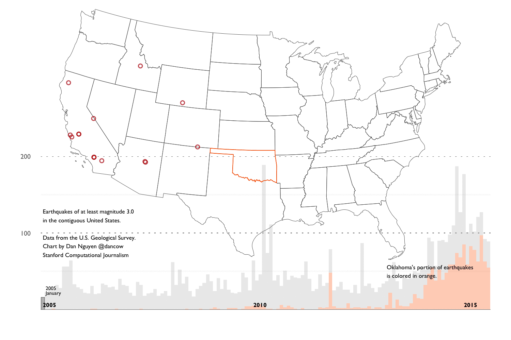

# U.S. Geological Survey Earthquake Events Archive

The U.S. Geological [Earthquake Hazards program](http://earthquake.usgs.gov/) has a searchable catalog of earthquake data -- including geospatial coordinates, date/time to the milliseconds, and magnitude. This repository packages the data in easy-to-download CSV format for analysis, including packages small enough to fit into memory/spreadsheets.

Here's an example of a multi-layered data visualization (URL TK) created using ggplot, showing the massive increase of M3.0+ earthquakes in Oklahoma in the last decade:





# The data packages

Here is the USGS data broken down into several, easy to download packages:

- [Worldwide, 2016 (year to date)](https://helloworlddata.github.io/usgs-earthquakes/data/usgs-earthquakes-worldwide-2016.csv)
- [Worldwide, 2015](https://helloworlddata.github.io/usgs-earthquakes/data/usgs-earthquakes-worldwide-2015.csv)
- [Worldwide, 2010 through 2014](https://helloworlddata.github.io/usgs-earthquakes/data/usgs-earthquakes-worldwide-2010-through-2015.csv)
- [Worldwide, 1960 through 1999 (TK)](https://helloworlddata.github.io/usgs-earthquakes/data/usgs-earthquakes-worldwide-worldwide-decade-2000.csv)
- [The contiguous United States, from 2000 through 2015](https://helloworlddata.github.io/usgs-earthquakes/data/usgs-earthquakes-contiguous-united-states-2000-through-2015.csv)
- [The Oklahoma region, all years](https://helloworlddata.github.io/usgs-earthquakes/data/usgs-earthquakes-oklahoma-region.csv)


# The stories


## Sources

- Archive search form: http://earthquake.usgs.gov/earthquakes/search/
- USGS CSV specification: http://earthquake.usgs.gov/earthquakes/feed/v1.0/csv.php


# Development (i.e. about this process)

This is just me hacking around until I find proper conventions for making a hand-operated extract-transform-load system for data that is entirely based around hosting flat-files on Github (and the limitations thereof).


The [Rakefile](Rakefile) contains all the tasks needed to fetch, process, and package the data. The final products are in [data/](data/).

For example, to generate the file [data/usgs-earthquakes-decade-1970.csv](data/usgs-earthquakes-2016.csv):

```sh
# create the subdirectories, including wrangle/corral
$ rake setup

# run it with --build-all to force it to rebuild dependencies
$ rake data/usgs-earthquakes-decade-1970.csv
```

This will run a series of Python 3 scripts in [wrangle/scripts/](wrangle/scripts/), which are all one-off tasks that spit out to stdout. 

The file [data/usgs-earthquakes-decade-1970.csv](data/usgs-earthquakes-decade-1970.csv) is dependent on 120 separate data files in an __untracked__ directory named `wrangle/corral/fetched`. Running the rake task will build that directory and fetch the required data from the USGS archive:

```
└── wrangle
    └── corral
        └── fetched
            ├── 1970-01.csv
            ├── 1970-02.csv
            ├── 1970-03.csv
            ...
            ├── 1979-10.csv
            ├── 1979-11.csv
            ├── 1979-12.csv
```

Each file represents a month's worth of data, e.g. `1970-03.csv` represents the earthquake data in the [USGS archive](http://earthquake.usgs.gov/earthquakes/search/) for March 1970.

This fetching is done by [wrangle/scripts/fetch_month_from_archive.py](wrangle/scripts/fetch_month_from_archive.py), which is just a thin wrapper around this call:

http://earthquake.usgs.gov/fdsnws/event/1/query.csv?starttime=1970-03-01%2000:00:00&endtime=1970-04-01%2000:00:00&orderby=time-asc


Why does the fetching script only pull one month at a time? Because the [USGS Archive](http://earthquake.usgs.gov/earthquakes/search/) won't return more than 20,000 hits per query, and fetching by month bypasses the need to write pagination logic in the fetching script.

Why does the [data/](data/) directory contain packages of arbitrary time periods, e.g.  [data/usgs-earthquakes-2010-through-2014.csv](data/usgs-earthquakes-2010-through-2014.csv) and [data/usgs-earthquakes-decade-1980.csv](data/usgs-earthquakes-decade-1980.csv)? Because Github has a file size limit of 100MB.

There is also a soft limit for total size of a repo. For that reason, the `wrangle/corral` folder, which is where files are fetched and stored to, is not tracked.


This repo is not meant to be a direct mirror of the USGS archive, but to contain easy-to-access packages of data for educational/experimental purposes.
http://www.nytimes.com/2016/09/04/us/earthquake-ties-record-for-strongest-in-oklahoma-history.html
